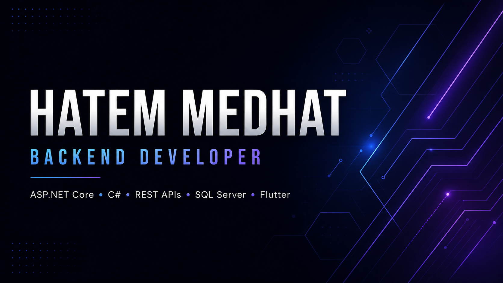

  

# Hatem Medhat

### Backend Developer · ASP.NET Core · REST APIs · Flutter

  Building scalable APIs, maintainable applications, and practical software solutions.

---

## About Me

I’m a software developer focused on **backend engineering and application development**.

My primary focus is building **RESTful APIs and business applications** with an emphasis on clean code, maintainable architecture, authentication and authorization, database design, and real-world functionality.

I enjoy turning ideas into complete software solutions while continuously improving my engineering skills and development practices.

---

## What I Build

  
  
  
  

  <strong>Authentication</strong> ·
  <strong>Authorization</strong> ·
  <strong>API Development</strong> ·
  <strong>Database Design</strong> ·
  <strong>Application Architecture</strong>

---

## Profile Highlights

  <strong>Backend Development</strong> ·
  <strong>REST API Design</strong> ·
  <strong>Authentication & Authorization</strong> ·
  <strong>Database Engineering</strong> ·
  <strong>Flutter Applications</strong>

  <i>Focused on building clean, maintainable, and production-ready software.</i>

---

## Tech Stack

<table>
  <tr>
    <td align="center" width="50%">
      <h3>Backend</h3>
      
        
      
      
      
    </td>
    <td align="center" width="50%">
      <h3>Database</h3>
       
      
        
      
    </td>
  </tr>

  <tr>
    <td align="center" width="50%">
      <h3>Mobile</h3>
      
        
      
      
    </td>
    <td align="center" width="50%">
      <h3>Tools</h3>
      
        
      
      
    </td>
  </tr>
</table>

### Architecture & Engineering

  
  
  
  

---

## Featured Projects

### 🔐 CAS Login Backend

A centralized **authentication and authorization backend** built with ASP.NET Core, designed for secure identity integration and API-based access control.

**Technologies:** `C#` · `ASP.NET Core` · `JWT` · `SQL Server` · `REST API`

---

### 🛒 E-Commerce Web API

A backend-focused e-commerce API demonstrating **RESTful API design, business logic, database integration, and maintainable backend architecture**.

**Technologies:** `C#` · `ASP.NET Core` · `Entity Framework Core` · `SQL Server` · `REST API`

---

### 🛍️ Creators Corner

A mobile e-commerce platform connecting customers with local brands through **product discovery, comparison, payments, delivery, ratings, and communication**.

**Technologies:** `Flutter` · `Dart` · `ASP.NET Core` · `REST API` · `SQL Server`

---

### 🌐 ElSewedy Portfolio Website

A professional **company portfolio website** created to showcase the organization's services, projects, and digital presence through a modern and responsive web experience.

**Technologies:** `HTML` · `CSS` · `JavaScript` · `Responsive Design`

---

  <i>More projects and experiments are available throughout my repositories.</i>

---

## Connect With Me

  
  
  
  

  
  

  <i>Building software, solving problems, and continuously improving.</i>

