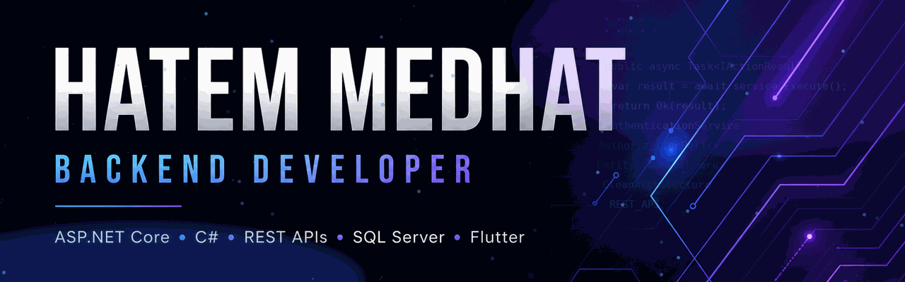

  

# Hatem Medhat

  

  Building scalable APIs, maintainable applications, and practical software solutions.

---

## About Me

  <strong>Backend-focused software developer building secure, scalable, and maintainable applications.</strong>

  I specialize in <strong>ASP.NET Core</strong>, RESTful API development, authentication & authorization,
  database-driven applications, and Flutter integration.

  <strong>Clean Code</strong> ·
  <strong>Good Architecture</strong> ·
  <strong>Real-World Solutions</strong>

---

## Core Expertise

  
  
  
  
  
  

  <strong>Clean Architecture</strong> ·
  <strong>API Integration</strong> ·
  <strong>Database Design</strong> ·
  <strong>Secure Systems</strong> ·
  <strong>Maintainable Software</strong>

---

## Engineering Focus

  
  
  
  

  Designing software with a balance of <strong>performance, security, maintainability, and usability</strong>.

---

## Tech Stack

<table>
  <tr>
    <td align="center" width="50%">
      <h3>Backend</h3>
      
        
      
      
      
    </td>
    <td align="center" width="50%">
      <h3>Database</h3>
       
      
        
      
    </td>
  </tr>

  <tr>
    <td align="center" width="50%">
      <h3>Mobile</h3>
      
        
      
      
    </td>
    <td align="center" width="50%">
      <h3>Tools</h3>
      
        
      
      
    </td>
  </tr>
</table>

### Architecture & Engineering

  
  
  
  

---

  
  
  
  

---

## Featured Projects

### 🔐 CAS Login Backend

A centralized **authentication and authorization backend** built with ASP.NET Core for integrating secure login and identity management across connected applications.

**Highlights:** JWT authentication · Authorization · Secure API design · SQL Server · Swagger

**Technologies:** `C#` · `ASP.NET Core` · `Entity Framework Core` · `SQL Server` · `REST API`

---

### 🛒 E-Commerce Web API

A backend-focused e-commerce API designed around **RESTful services, business logic, database operations, and maintainable application architecture**.

**Highlights:** Product management · Business logic · Database integration · RESTful endpoints · API documentation

**Technologies:** `C#` · `ASP.NET Core` · `Entity Framework Core` · `SQL Server` · `REST API`

---

### 🛍️ Creators Corner

A mobile e-commerce platform created to connect customers with local brands through **product discovery, comparison, purchasing, delivery, ratings, and communication**.

**Highlights:** Product discovery · Product comparison · Payments · Delivery · Ratings · Chat

**Technologies:** `Flutter` · `Dart` · `ASP.NET Core` · `REST API` · `SQL Server`

---

### 🌐 ElSewedy Portfolio Website

A professional **company portfolio website** created to present the organization's identity, services, projects, and digital presence through a modern responsive experience.

**Highlights:** Responsive design · Company presentation · Project showcase · Modern UI · Cross-device experience

**Technologies:** `HTML` · `CSS` · `JavaScript` · `Responsive Design`

---

  <i>More projects and experiments are available throughout my repositories.</i>

---

## GitHub Contributions

  

---

## Connect With Me

  
  &nbsp;&nbsp;&nbsp;
  
  &nbsp;&nbsp;&nbsp;
  
  &nbsp;&nbsp;&nbsp;
  

  
  &nbsp;
  

  <i>Open to building interesting software and meaningful projects.</i>

---

  

